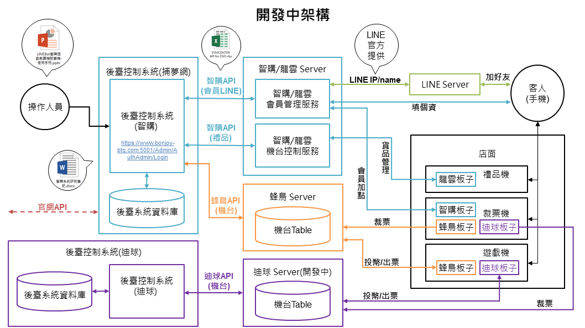

# Dejoy-Server-For-Terminal-Data-Collection

☂️迪球公司負彙整吐終端機(各種機台)資料狀態並送至系統的Server


### Build Environment 建置環境

node.js 版本16.14.2
npm 版本8.5.0

### Quick Start 快速開始

在目錄中安裝npm，並用npm init命令初始化package.json文件。
`cd {你的項目目錄}`
`npm init`


安裝express
`npm install express --save`

執行伺服器
`node server.js`

### 目錄結構

```
Dejoy-Server-For-Terminal-Data-Collection
│   README.md
│   server.js
│
└───img
│   └─現行架構.PNG
│
└─respones
    └─merchant
        ├─place
        └─places
```


